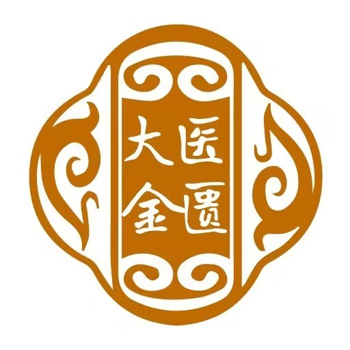
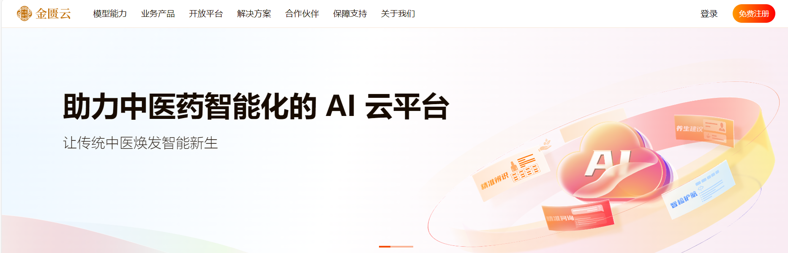
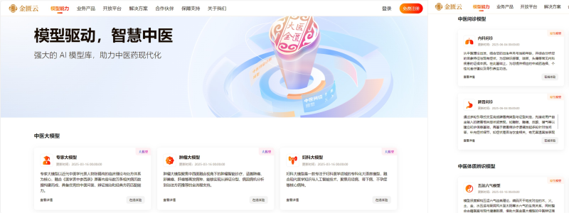
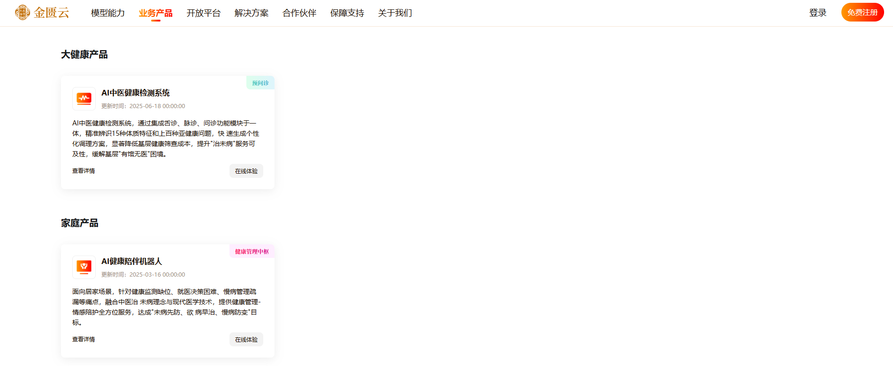
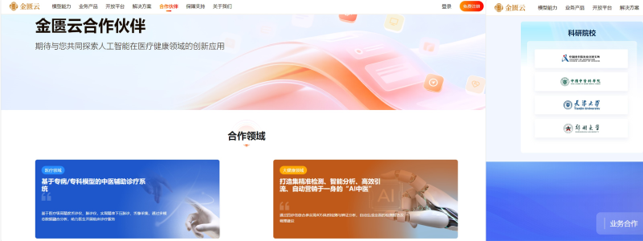

<h1 align="center">Dayi-Jingui TCM Domain Large Language Model</h1>

<b>🌐 Official Website: </b><a href="https://tcm.wenge.com/">https://tcm.wenge.com/</a>

<b>🌐 Language: </b> English | <a href="README_zh.md">中文</a>

# ⚡️ Overview

​	When the millennium-old "Art of Qihuang" meets artificial intelligence, the Traditional Chinese Medicine industry enters a new chapter of intelligence!

​	With AI as the brush and data as the ink, we proudly introduce the Jingui Cloud Platform 1.0. Empowering the modernization of TCM with the strength of AI, this platform serves as a vital tool for the intelligent transformation of the industry. We are committed to integrating traditional TCM wisdom with cutting-edge AI technology to inject new vitality and intelligence into the field.

# 🧠 Model Capabilities / Building a "Thinking" TCM AI Brain

- **TCM Domain Large Language Model**: Pre-trained on massive classic medical cases and modern clinical data, possessing deep capabilities in Syndrome Differentiation and Treatment. Includes specialized models such as the Expert LLM, Oncology LLM, and Gynecology LLM.

- **TCM Consultation LLM**: Based on TCM theories, it simulates the diagnostic thinking of renowned physicians. It accurately collects multi-diagnostic information through natural interaction and provides recommendations for Chinese Patent Medicines, personalized dietary therapy, and Daoyin health exercises. It covers internal medicine, gynecology, pediatrics, and spleen-stomach disorders.

- **TCM Constitution Identification LLM**: Relying on the "Dayi-Jingui" foundational model, it integrates data from tongue diagnosis, face diagnosis, and inquiry to achieve rapid and accurate identification of common TCM constitutions, such as Balanced Constitution (Pinghe), Yang-Deficiency Constitution (Yangxu), Yin-Deficiency Constitution (Yinxu), and Phlegm-Dampness Constitution (Tanshi).

- **TCM Feature Detection LLM**: Supports precise extraction of key features from tongue images, including tongue body color, coating color, tooth marks, and coating thickness. It also conducts multi-dimensional compliance detection for the tongue images to be analyzed.

# 🧩 Products / Creating an Intelligent Health Product Matrix

- **General Health Product — AI TCM Health Assessment System**: Integrates Tongue, Pulse, and Inquiry diagnostics to accurately identify 15 types of body constitutions and hundreds of sub-health issues, rapidly generating personalized regulation plans and significantly reducing grassroots health screening costs.

- **Home Care Product — AI Health Companion Robot**: A 24-hour home health partner providing comprehensive services from health management to emotional companionship, achieving the goal of "Preventive Treatment of Disease" (preventing illness before it arises and preventing existing conditions from worsening).

# 🔗 Open Platform / Co-building a TCM Innovation Ecosystem

The Jingui Cloud Platform provides Open API interfaces, granting access to four core models. We offer comprehensive developer manuals and robust technical support to help developers build new intelligent TCM application scenarios.

# 🧭 Solutions / Multi-scenario Application Deployment

- **Medical Scenarios**: Smart Diagnosis and Treatment Platform, assisting doctors in improving clinical efficiency and the accuracy of syndrome differentiation. Includes: TCM Smart Diagnosis & Health Management Platform, TCM-LLM, and Smart Health Stations.

- **General Health Scenarios**: Providing an integrated "Detection + Analysis + Regulation" smart health management solution. Includes: AI TCM Health Analyzer and AI Health Detection Kiosks.

- **Home Scenarios**: Bringing convenient TCM health monitoring and management services into every household through AI Health Companion Robots.

# 🤝 Partners / Diverse Cooperation for a Win-Win Intelligent Ecosystem

Jingui Cloud adheres to the philosophy of "Openness, Integration, and Collaborative Innovation." We have established industry-academia-research collaborative relationships with numerous renowned medical institutions, TCM enterprises, and research universities. We welcome more partners to join us in promoting the intelligent transformation of TCM, achieving resource sharing, complementary advantages, and win-win cooperation.

# 🛡️ Support & Guarantee / Solid Backing for Worry-Free Service

To ensure users can use the platform with confidence, we provide 7x24 exclusive telephone support, with a professional technical team ready to respond to inquiries at any time. For complex issues, we offer remote assistance services, resolving problems quickly through online guidance and remote debugging.

# 🚪 Access & Usage

Official Website: <a href="https://tcm.wenge.com/">https://tcm.wenge.com/</a>

# ⚠️ Disclaimer

The model output is for academic and educational reference only and does not constitute medical diagnosis or treatment advice. Please use it within a compliant and ethical framework and strictly abide by privacy and data security requirements.

# 📚 Citation

If you use Dayi-Jingui in your research or report, please cite it as follows:

@misc{Dayi-Jingui,
  title={Dayi-Jingui: A TCM domain Large Language Model},
  author={DYJG-research},
  year={2025},
  url={https://github.com/DYJG-research/Dayi-Jingui}
}
