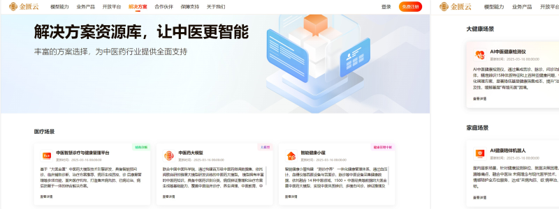

<h1 align="center">大医金匮中医大模型</h1>

<p align="center">

</p>

<p align="center">
  <b>🌐 官网入口：</b><a href="https://tcm.wenge.com/">https://tcm.wenge.com/</a>
</p>

<p align="center">
  <b>🌐 Language：</b> <a href="README.md">English</a> | 中文
</p>

## ⚡️ 概览

​	  当千年岐黄之术邂逅人工智能科技，中医药行业迎来智能化新篇章！

​	  AI为笔、数据为墨。我们隆重推出——**金匮云平台1.0**，以AI之力，推动中医药现代化发展。作为中医药行业智能化转型的重要工具，本平台致力于通过前沿的AI技术，推动传统中医药与现代科技深度融合，为行业注入新的活力与智慧。

<p align="center">

</p>

## 🧠 模型能力 / 构建“会思考”的中医AI大脑

 - **中医大模型**：基于海量经典医案与现代临床数据训练，具备深度辨证论治能力。包括专家大模型、肿瘤大模型以及妇科大模型等。
 - **中医问诊模型**：从中医理论出发，模拟名医问诊思维，通过自然交互精准完成多诊信息收集，并基于此提供相应的中成药选择、个性化食疗建议及导引养生功法。包含内科、妇科、儿科及脾胃等方面的问诊。
 - **中医体质辨识模型**：依托“大医金匮”大模型，融合舌、面、问诊数据，实现平和质、阳虚质、阴虚质、痰湿质等常见中医体质的快速、精准辨识。
 - **中医特征检测模型**：支持对舌象图片的舌色、苔色、齿痕、薄厚等关键特征进行精准提取，同时可对待检测舌图开展多维度合规性检测。

<p align="center">

</p>

## 🧩 业务产品 / 打造智能健康产品矩阵

 - **大健康产品— AI中医健康检测系统**：集舌脉问于一体，精准辨识15种体质特征和上百种亚健康问题，快速生成个性化调理方案，显著降低基层健康筛查成本。

 - **家庭产品—AI健康陪伴机器人**：24小时居家健康伙伴，提供健康管理-情感陪护全方位服务，达成“未病先防、欲病早治、慢病防变”目标。

<p align="center">

</p>

## 🔗 开放平台 / 共筑中医药创新智能体

 金匮云提供开放API接口，开放四大核心模型的调用权限，提供开发者手册，为开发者提供强大的技术支持，助力构建中医药智能应用新场景。

<p align="center">

</p>

## 🧭 解决方案 / 提供多场景的落地应用

 - **医疗场景**：智慧诊疗平台，辅助医生提升中医临床效率与辨证精准度。包括：中医智慧诊疗与健康管理平台、中医药大模型和智能健康小屋。

 - **大健康场景**：提供“检测+分析+调理”一体化智能健康管理方案。包括：AI中医健康检测仪和AI健康检测一体机。

 - **家庭场景**：通过AI健康陪伴机器人将便捷的中医健康监测与管理服务带入每一个家庭。

<p align="center">

</p>

## 🤝 合作伙伴 / 多元合作共赢，共建智能生态

金匮云秉持着“开放融合、协同创新”的理念，已同多家知名医疗机构、中医药企业及科研院校等展开合作，建立产学研协同关系。也欢迎更多合作伙伴的加入，携手推动中医药智能化进程，实现资源共享、优势互补、合作共赢。

<p align="center">

</p>

## 🛡️ 保障支持 / 提供坚实后盾，确保服务无忧

为确保用户放心使用，平台提供7x24小时专属电话支持，专业技术团队随时响应问题咨询；针对复杂问题提供远程协助服务，通过在线指导、远程调试等方式快速解决问题。

<p align="center">

</p>

## 🚪 访问与使用

- **官网入口**：<a href="https://tcm.wenge.com/">https://tcm.wenge.com/</a>

## ⚠️ 免责声明

模型输出仅供参考，不构成医疗诊断或治疗建议；请在合规与伦理框架下使用，并遵守隐私与数据安全要求。


## 📚 引用

如果您在研究或报告中使用了大医金匮，请引用如下：

```bibtex
@misc{Dayi-Jingui,
  title={Dayi-Jingui: A TCM domain Large Language Model},
  author={DYJG-research},
  year={2025},
  url={https://github.com/DYJG-research/Dayi-Jingui}
}
```

